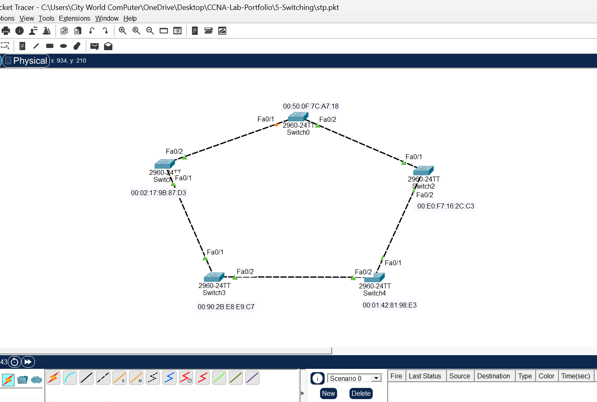
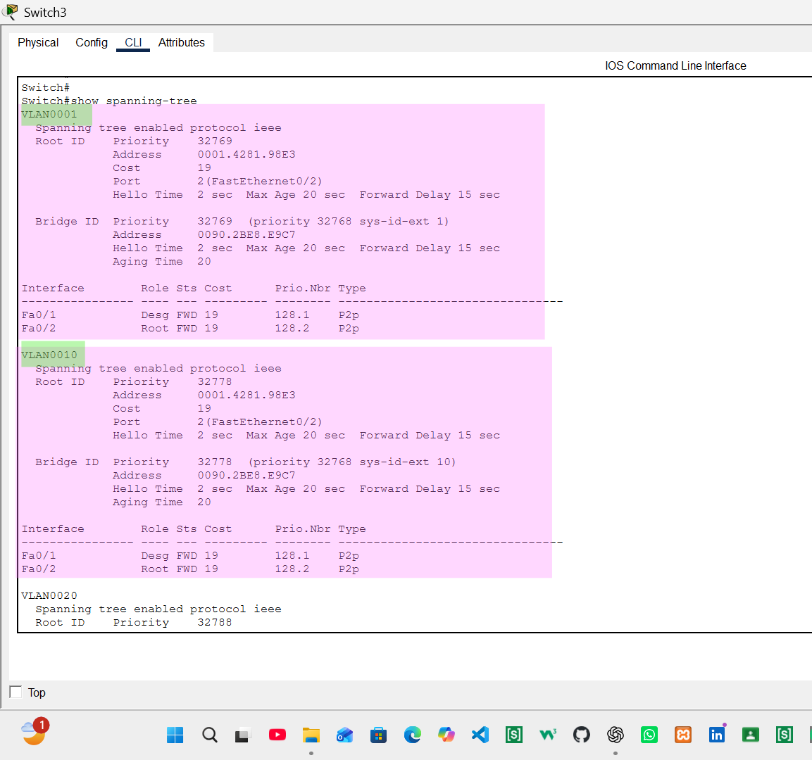
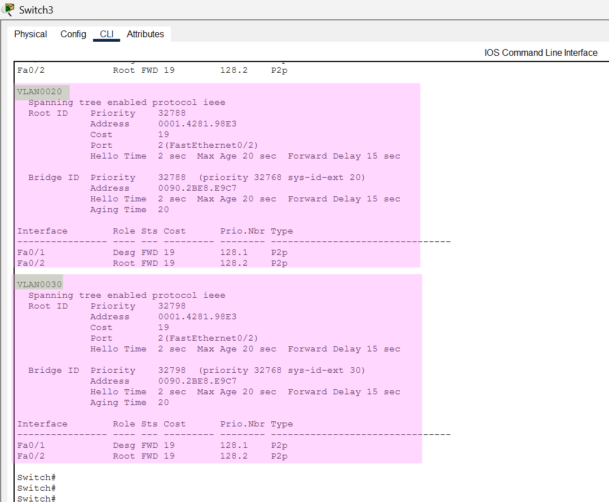
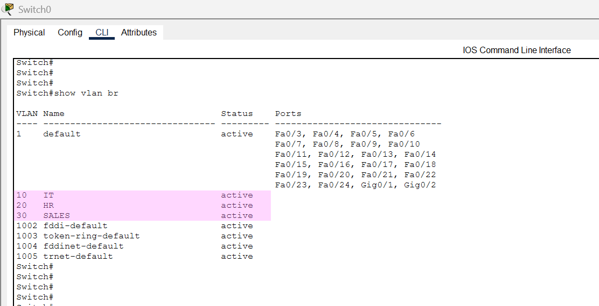
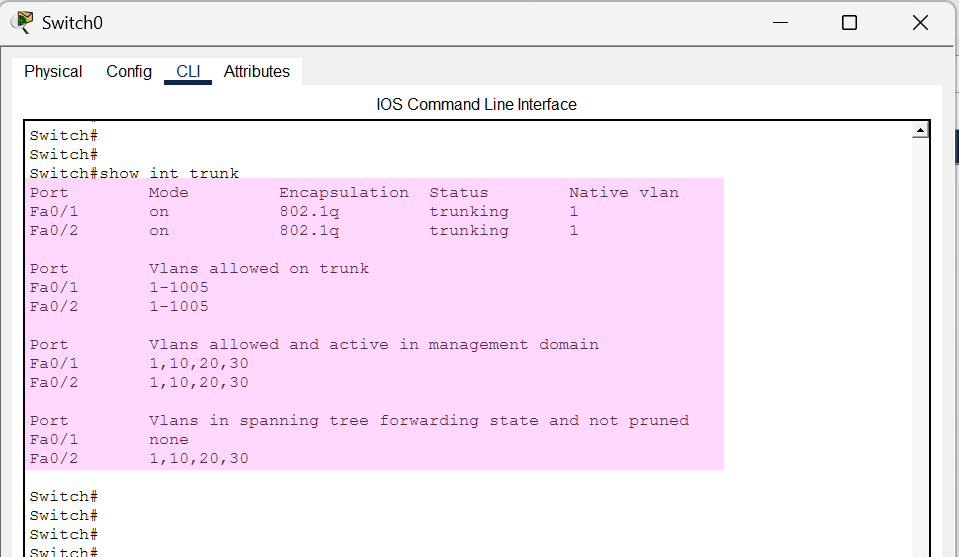

# STP & VLAN Configuration Lab

## 📌 Overview

This lab demonstrates the configuration and verification of **VLANs, Trunk Links, and Spanning Tree Protocol (STP)** using Cisco switches in Cisco Packet Tracer.

The topology consists of five interconnected switches with redundant links. STP is used to prevent Layer 2 switching loops by placing redundant paths into an alternate/blocking state while maintaining network redundancy.

---

## 🎯 Objectives

- Configure VLANs on multiple switches
- Configure inter-switch links as trunk ports
- Understand the purpose of Spanning Tree Protocol (STP)
- Identify the Root Bridge
- Identify Root Ports and Designated Ports
- Observe Alternate/Blocking ports
- Verify VLAN configuration
- Verify trunk configuration
- Verify STP operation using Cisco IOS commands

---

## 🛠️ Tools & Technologies

- Cisco Packet Tracer
- Cisco IOS
- VLAN
- IEEE 802.1Q Trunking
- Spanning Tree Protocol (STP)
- Layer 2 Switching

---

## 🌐 Network Topology

The topology contains five interconnected switches with redundant links.

The redundant connections create a potential Layer 2 loop. STP detects the redundant path and places an appropriate port into an alternate/blocking state to prevent switching loops.

---

## 🏷️ VLAN Configuration

The following VLANs were configured on the switches:

| VLAN ID | VLAN Name | Purpose |
|--------:|-----------|---------|
| 10 | IT | IT Department |
| 20 | HR | HR Department |
| 30 | SALES | Sales Department |

VLANs provide logical network segmentation and separate broadcast domains.

### VLAN Configuration Commands

    enable
    configure terminal

    vlan 10
    name IT
    exit

    vlan 20
    name HR
    exit

    vlan 30
    name SALES
    exit

---

## 🔗 Trunk Configuration

Inter-switch connections were configured as trunk links to allow multiple VLANs to travel between switches.

### Trunk Configuration Command

    interface fa0/1
    switchport mode trunk

The appropriate switch-to-switch interfaces were configured as trunk ports according to the topology.

---

## 🌳 Spanning Tree Protocol

Spanning Tree Protocol (STP) was used to prevent Layer 2 switching loops caused by redundant connections.

STP elects a **Root Bridge** and determines the best paths through the network. Redundant paths can be placed into an **Alternate/Blocking** state to prevent loops while keeping a backup path available.

### STP Verification Command

    show spanning-tree

This command was used to verify:

- Root Bridge
- Root Ports
- Designated Ports
- Alternate/Blocking Ports
- Port States
- STP information for active VLANs

### STP Verification Screenshots

---

## 🔍 Verification Commands

### 1. Verify VLANs

    show vlan brief

This command verifies that VLAN 10, VLAN 20, and VLAN 30 were successfully created.

---

### 2. Verify Trunk Links

    show interfaces trunk

This command verifies the configured trunk interfaces and the VLANs allowed across the trunk links.

---

### 3. Verify STP

    show spanning-tree

This command displays the STP topology, Root Bridge information, port roles, and port states.

---

### 4. Verify STP for a Specific VLAN

    show spanning-tree vlan 10

This command displays STP information specifically for VLAN 10.

---

## 📸 Lab Evidence

The following screenshots provide evidence of the configuration and verification performed in this lab:

- Network topology
- STP verification
- STP verification for additional switch/output
- Trunk verification
- VLAN verification

---

## 📁 Project Structure

    STP_VLAN_Lab/
    │
    ├── STP_VLAN_Lab.pkt
    ├── stp_topology.png
    ├── stp_show_spanning_tree_1.png
    ├── stp_show_spanning_tree_2.png
    ├── stp_trunk.png
    ├── vlan_brief.png
    └── README.md

---

## ✅ Results

The lab successfully demonstrates:

- VLAN creation and configuration
- VLAN-based network segmentation
- Trunk link configuration
- STP operation in a redundant topology
- Root Bridge identification
- Root and Designated Port identification
- Alternate/Blocking port identification
- Layer 2 loop prevention
- Configuration verification using Cisco IOS commands

---

## 📚 Key Learning Outcomes

Through this lab, I gained practical experience with **VLAN segmentation, trunking, Layer 2 redundancy, and Spanning Tree Protocol**.

The lab improved my understanding of how STP automatically manages redundant paths and prevents Layer 2 switching loops while maintaining network redundancy and availability.

---

