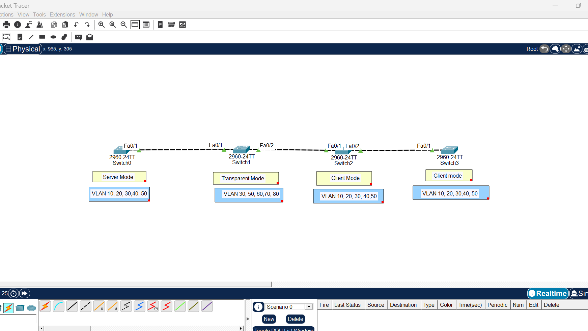

# 🔄 VTP (VLAN Trunking Protocol) Lab

> 🚀 A Cisco Packet Tracer lab demonstrating **VTP Server, Transparent, and Client modes** in a multi-switch network.

---

## 🌐 Network Overview

This lab demonstrates how **VLAN Trunking Protocol (VTP)** can be used to manage VLAN information across multiple switches.

The network consists of **four switches**, each configured with a specific VTP role:

```text
                    VTP DOMAIN
                        │
                        ▼
   ┌──────────┐    ┌──────────────┐    ┌─────────┐    ┌─────────┐
   │ Switch0  │────│   Switch1    │────│ Switch2│────│ Switch3│
   │  SERVER  │    │ TRANSPARENT  │    │ CLIENT │    │ CLIENT │
   └──────────┘    └──────────────┘    └─────────┘    └─────────┘
```
---


## ⚙️ VTP Configuration

| 🖥️ Switch | 🔐 VTP Mode | 🏷️ VLANs |
|---|---|---|
| **Switch0** | 🟢 Server | 10, 20, 30, 40, 50 |
| **Switch1** | 🟡 Transparent | 30, 50, 60, 70, 80 |
| **Switch2** | 🔵 Client | 10, 20, 30, 40, 50 |
| **Switch3** | 🔵 Client | 10, 20, 30, 40, 50 |

---

## 🎯 Lab Objectives

- 🔹 Configure **VTP Server Mode**
- 🔹 Configure **VTP Transparent Mode**
- 🔹 Configure **VTP Client Mode**
- 🔹 Create and verify VLANs
- 🔹 Configure trunk links between switches
- 🔹 Verify VTP operation and VLAN information
- 🔹 Understand VLAN propagation in a VTP environment

---

## 🧪 What I Practiced

### 🟢 VTP Server — Switch0

Created:

`VLAN 10 | VLAN 20 | VLAN 30 | VLAN 40 | VLAN 50`

### 🟡 VTP Transparent — Switch1

Created locally:

`VLAN 30 | VLAN 50 | VLAN 60 | VLAN 70 | VLAN 80`

### 🔵 VTP Clients — Switch2 & Switch3

Verified VLAN information received through the VTP environment.

---

## 🔍 Verification

The following Cisco IOS commands were used to verify the lab:

```bash
show vtp status
```

```bash
show vlan brief
```

```bash
show interfaces trunk
```

These commands were used to verify:

- ✅ VTP operating mode
- ✅ VLAN information
- ✅ VLAN availability on switches
- ✅ Trunk connectivity

---

## 📸 Lab Screenshots

### 🗺️ Network Topology



### 🟢 VTP Server


### 🟡 VTP Transparent


### 🔵 VTP Client 1


### 🔵 VTP Client 2


### 🔗 Trunk Verification


---

## 📚 Key Takeaways

> 💡 This lab helped me understand the practical use of **VTP in VLAN management**, the difference between **Server, Transparent, and Client modes**, and the importance of **trunk links** for switch-to-switch communication.

---

## 🛠️ Technologies & Concepts

`Cisco Packet Tracer` • `Cisco IOS` • `VLAN` • `VTP` • `802.1Q Trunking`

---

## 📁 Lab File

The complete Packet Tracer project is included in this repository:

**`VTP_Lab.pkt`**
